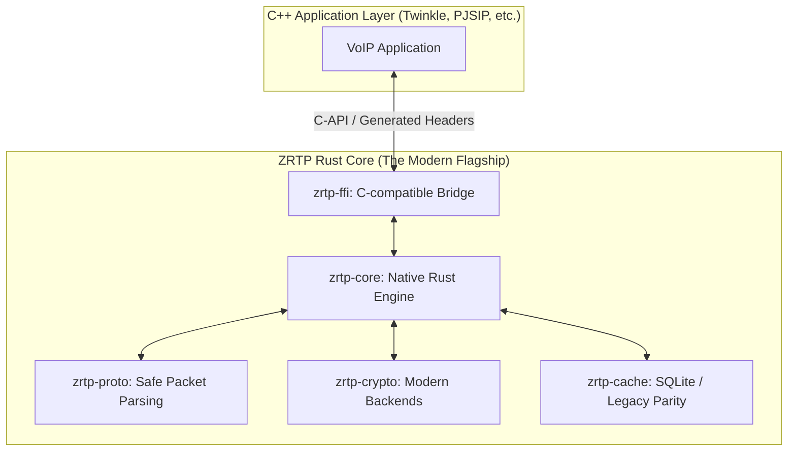

# Apache 2.0 ZRTP Rust Port

> [!IMPORTANT]
> **Project Update: Rust Conversion Complete**
> This project has been successfully ported to Rust to provide industry-leading security, memory safety, and maintainability. The Rust implementation is located in the `rust/` directory and is feature-complete, including full RFC 6189 compliance, modern crypto (X25519), and legacy binary cache parity.

Thanks Phil for PGP and ZRTP. Also Werner Dittmann for the original C++ code.

FP

## Table of Contents
- [1. Overview & Architecture](#1-overview--architecture)
- [2. The Modern Core (Rust Implementation)](#2-the-modern-core-rust-implementation)
- [3. Security Features Matrix](#3-security-features-matrix)
- [4. Core Protocol & Integrity](#4-core-protocol--integrity)
- [5. Integration Guide](#5-integration-guide)
- [6. Legacy C++ Documentation](#6-legacy-c-documentation)
- [7. Acknowledgments & Credits](#7-acknowledgments--credits)

---

## 1. Overview & Architecture

This package provides a library that adds ZRTP support to RTP stacks (ccRTP, PJSIP, GStreamer). Phil Zimmermann developed ZRTP to allow ad-hoc, easy to use key negotiation to setup Secure RTP (SRTP) sessions.

### System Integration Model
The Rust implementation is designed as a drop-in replacement for the original C++ engine, exposing a C-compatible API via a Foreign Function Interface (FFI).



---

## 2. The Modern Core (Rust Implementation)

The Rust port (`rust/` directory) provides a modern, secure, and performant alternative to the original C++ implementation.

### Key Features
*   **Memory Safety**: Built with safe Rust to eliminate buffer overflows and memory-related bugs.
*   **Modern Cryptography**: Uses `X25519` for Elliptic Curve Diffie-Hellman, `SHA-256` for hashing, and `AES-CFB` for session confirmation.
*   **Modular Architecture**: Provider-based design for agile cryptographic backend swapping.
*   **Verified Handshake**: Supports full DH-based handshake from discovery to secure state.
*   **Fragmented Handshake Support**: Support for large cryptographic payloads (like PQC signatures) that exceed standard MTUs.

---

## 3. Security Features Matrix

This implementation goes beyond standard RFC 6189 to provide state-of-the-art protection.

| Feature | Mechanism | Benefit | Status |
| :--- | :--- | :--- | :--- |
| **Symmetric Ratchet** | Periodic HMAC re-keying | Continuous Forward Secrecy | ✅ Implemented |
| **PQ Hybrid (PQH)** | ML-KEM-768 + Falcon-512 | Quantum-Resistance | 🛠 Design/Trait |
| **RFC 6189 Compliance** | Corrected PGP Word Lists | Interoperability | ✅ Implemented |
| **Memory Safety** | Native Rust rewrite | Zero Buffer Overflows | ✅ Implemented |
| **Survival Mode** | Survival vs forced GoClear | Anti-DoS / Interception | ✅ Implemented |

---

## 4. Core Protocol & Integrity

### Integrity & Conversion Philosophy
The Rust port was executed as a **faithful functional mapping** of the original C++ codebase.

*   **Bit-Perfect Protocol Parity**: All Session Key (SRTP) and Intermediate Secret (S0) derivations use the exact same logic as defined in RFC 6189.
*   **Preservation of Delayed Verification**: We have strictly preserved ZRTP's signature Delayed Verification mechanism (H0-H3).
*   **Structural Parity (Legacy Cache)**: The `BinaryFileCache` uses `#[repr(C, packed)]` to recreate the exact memory layout of the C++ `zidrecord2_t`.

### Codebase Organization
```text
.
├── zrtp/                   # [Legacy] Original C++ core engine
├── cryptcommon/            # [Legacy] C++ crypto primitives
├── rust/                   # [Modern] New Rust Implementation
│   ├── zrtp-proto/         # Packet parsing (nom)
│   ├── zrtp-crypto/        # X25519, SHA256, SAS Base32
│   ├── zrtp-core/          # State Machine & Handshake logic
│   ├── zrtp-cache/         # Dual-mode (SQLite & Binary Flat File)
│   └── zrtp-ffi/           # C-Bridge & Generated zrtp-ffi.h
├── cpp_example/            # Integration example using the Rust engine
└── CMakeLists.txt          # Shared build configuration
```

---

## 5. Integration Guide

To use the Rust engine in your C++ code, you only need the FFI bridge:

1.  **Include**: `#include "rust/zrtp-ffi/zrtp-ffi.h"`
2.  **Link**: Link against `libzrtp_ffi.a` (static) or `libzrtp_ffi.so/dylib` (dynamic).
3.  **Initialize**:
    ```cpp
    // Legacy parity:
    auto ctx = zrtp::zrtp_context_new_with_file(zid, "names.zrid");
    // Or modern:
    auto ctx = zrtp::zrtp_context_new_with_db(zid, "persistence.db");
    ```

---

## 6. Legacy C++ Documentation
*The following information refers to the original C++ library for historical reference.*

The Apache 2.0 ZRTP implementation is compliant to [RFC 6189][] and adds some more algorithms.

### Features Supported
* multi-stream mode
* Finite field Diffie-Hellman with 2048 and 3072 bit primes
* Elliptic curve Diffie-Hellman with 256 and 384 bit curves (NIST curves)
* Elliptic curves Curve25519 and Curve3617 (Dan Bernstein, Tanja Lange)
* Skein Hash and MAC for ZRTP
* AES-128 and AES-256 symmetric ciphers
* Twofish-128 and Twofish-256 bit symmetric ciphers
* SDES support

### Building & History
Since version 1.6 this implementation supports the *cmake* based build process:
```bash
mkdir build && cd build
cmake ..
make
```

> [!NOTE]
> Zfone is now outdated and not supported anymore.

### License & Wiki
The core ZRTP modules are licensed under **Apache V2**. Refer to [LICENSES](LICENSES/summary.md) for a summary of individual module licenses.
*   [ZRTP FAQ][zrtpfaq]
*   [ZRTP Howto][zrtphow]

---

## 7. Acknowledgments & Credits

This project stands on the shoulders of giants:

*   **Phil Zimmermann**: For the [ZRTP Specification (RFC 6189)](https://tools.ietf.org/html/rfc6189) and his lifelong commitment to privacy.
*   **Werner Dittmann**: For the original [Apache 2.0 ZRTP C++](https://github.com/wernerd/ZRTPCPP) implementation, which served as the architectural blueprint for this Rust port.
*   **The Rust Community**: For providing a world-class standard for memory safety and the foundational crates (`ring`, `dalek-cryptography`, `nom`).
*   **NIST PQC Project**: For the standardization of ML-KEM (Kyber) and ML-DSA (Falcon) algorithms.

---

[zrtphow]:  http://www.gnutelephony.org/index.php/GNU_ZRTP_How_To
[zrtpfaq]:  http://www.gnutelephony.org/index.php/ZRTP_FAQ
[rfc 6189]: http://tools.ietf.org/html/rfc6189
[LICENSES]: LICENSES/summary.md
