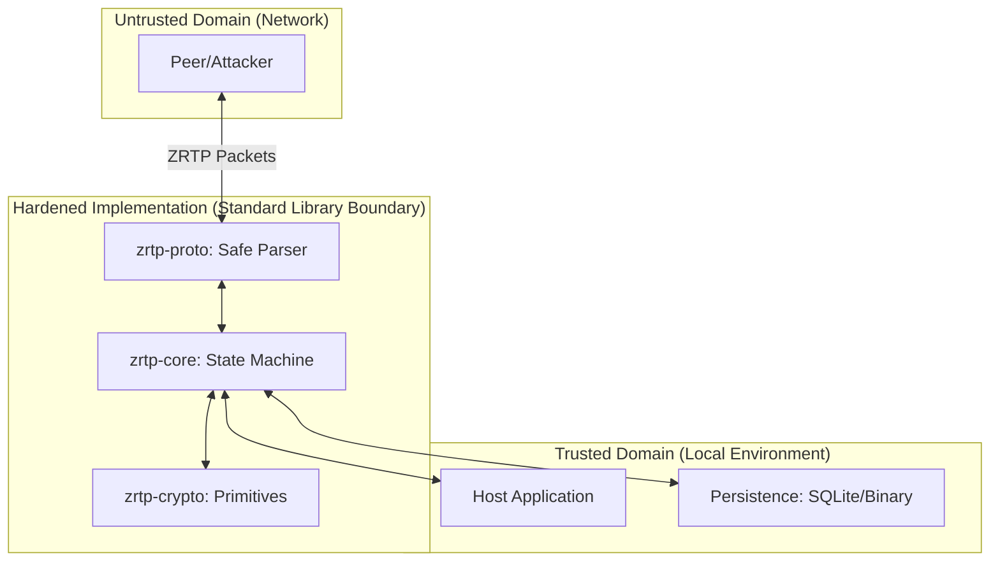

# ZRTP Threat Model for Security Researchers

This document provides a technical threat model for the **ZRTP Rust Implementation (v5.0.1)**. It outlines the attack surface, identified threat vectors, and the corresponding hardening measures implemented in the modern port.

## 1. System Architecture & Trust Boundaries

The ZRTP implementation acts as a cryptographic state machine between an untrusted network and a trusted application environment.

### Trust Assumptions
- **Host Integrity**: The local OS and storage (SQLite/Binary) are assumed to be trusted.
- **Crypto Primitives**: Foundational libraries (`ring`, `x25519-dalek`) are assumed to be secure.

---

## 2. Threat Vectors & Mitigations

### A. Network-Level Attacks (Unauthenticated Data)

| Threat | Description | Mitigation in v5.0.1 |
| :--- | :--- | :--- |
| **Parsing Vulnerabilities** | Memory corruption (Buffer Overflow/Over-read) via malformed packets. | **Native Rust + nom**: The parser is written in safe Rust using `nom`, ensuring zero-copy, bounds-checked parsing without pointer arithmetic. |
| **Fragmentation DoS** | Flooding the engine with partial fragments to exhaust heap memory. | **Fragment TTL & Validation**: Implementation of strict 30s TTL for fragments and consistency checks on `frag_count`. Stale/invalid fragments are aggressively purged. |
| **Replay Attacks** | Replaying ZRTP messages to disrupt state or force re-negotiation. | **State Logic Hardening**: Sequence number tracking and HVI (Hello Verification Indicator) checks prevent stale message processing. |

### B. Cryptographic Side-Channel Attacks

| Threat | Description | Mitigation in v5.0.1 |
| :--- | :--- | :--- |
| **Timing Attacks** | Leaking secrets (HMAC, Hash Chain, DH Shared Secret) via variable-time equality checks. | **Constant-Time Operations**: Standard library string/byte comparisons were replaced with `constant_time_eq` for all sensitive cryptographic verification paths. |
| **Algorithm Downgrade** | Forcing the session to use weak/deprecated algorithms (e.g., DH-1024). | **Strict Policy Enforcement**: The engine enforces a minimum crypto baseline and ignores algorithms not explicitly allowed in `ZrtpOptions`. |

### C. FFI & Host Integration (The "Bridge" Risk)

| Threat | Description | Mitigation in v5.0.1 |
| :--- | :--- | :--- |
| **FFI Null-Pointer Dereference** | Crash or undefined behavior via invalid pointers from C/C++ layer. | **FFI Hygiene**: Added comprehensive null-checks for all incoming pointers and opaque context handles. |
| **Resource Leaks** | Memory leaks in the C-wrapper preventing long-term stability. | **RAII & Safe Wrappers**: The FFI layer uses Rust's ownership model to ensure clean cleanup when `zrtp_context_free` is called. |

---

## 3. Latest Improvements (Hardening Delta)

Researchers should focus on the following "high-assurance" additions:

1.  **Elimination of Global State**: The entire engine is now encapsulated in `ZrtpContext`, removing potential race conditions found in older C++ implementations.
2.  **Strict RFC 6189 Compliance**: Corrected PGP word list renderings to prevent SAS "mismatch" confusion attacks during manual verification.
3.  **Survival Mode Enhancement**: Hardened logic for "Survival vs Forced GoClear" to prevent attackers from forcing an encrypted call into plaintext.
4.  **Audit-Ready Codebase**: The crate structure separates **Parsing** (`zrtp-proto`), **Crypto** (`zrtp-crypto`), and **Logic** (`zrtp-core`), simplifying independent verification of each layer.

---

## 4. Residual Risk & Recommendations

- **Post-Quantum Exposure**: While the architecture includes ML-KEM/Falcon traits, full integration is "Design-Phase." Production deployments should rely on established X25519 for now.
- **Side-Channel (Hardware)**: This implementation does not protect against physical-layer side-channels (e.g., power analysis) which are outside the scope of software implementation.

**Security researchers are encouraged to review the `zrtp-ffi` boundary and the `nom` parser definitions for any potential edge-case misses.**
